# Java Spring FrameWork Project(2021.07.19 ~ 2021.10.29) PMS

## 1.프로젝트 개요

>1. 이 프로젝트는 Spring FrameWork를 이용한 웹 프로젝트로 사내에서 사용하기 위한 Project Management System 이다. 
>2. 전자정부 프레임워크 3.7을 기반으로 구성된 프로젝트이다.
>3. 자체 솔루션인 IB Sheet7을 이용하여 Grid Layout 형태로 데이터를 표현한다. 

## 2. 프로젝트 자원

>+ 인력 : 3인
>+ 기간 : 약 3개월
>+ SW : MySQL 5.1, JDK 1.8, Lombok, eGoveFrameWork 3.7.0, Spring FrameWork 4.2.4, Jackson Json 2.9.7, Gson 2.8.4 Tomcat 8.5, IB Sheet7 
>+ 기타 정적 자원 : Free PNG Format Image & Free Font, IB Sheet7 Front Template

## 3. 프로젝트 수행흐름

>1. 요구사항 분석
>2. 설계 및 환경구축
>><ol> 2.1 화면설계(사용자 유형별 필수기능 자료 첨부하여 퍼블리싱 의뢰)</ol>
>><ol> 2.2 DB설계(테이블 정의서, ERD 등)</ol>
>3. 개발
>><ol> 3.1 DB구축 [본인] </ol>
>><ol> 3.2 프로젝트 초기설정(JDBC, Spring Security, IB Sheet7 Import 등) [본인] </ol>
>><ol> 3.3 기능 구현(화면[일반사용자, 중간관리자, 관리자], Java Quartz Scheduler, Spring Security 등) [본인 - IB Sheet7 페이지[WBS, 주간보고서], 회원관리 등</ol>

## 4. 프로젝트 시나리오

>+ SW 프로젝트에서 자원관리를 위해 사용되는 WBS 구현 및 사내에서 진행하는 주간보고에 맞는 주간보고서 자동 생성이 목표이다.
>+ WBS는 프로젝트를 관리하는 중간관리자(PM 또는 PL)에 의해 생성 및 관리된다.
>+ WBS의 계산식은 'XLGantt(엑셀간트)'를 참고한다.
>+ 주간보고서는 중간관리자가 할당해주는 작업 또는 일반사용자가 개인 Job 생성 및 관리를 통해 자동 생성된다.

## 5. 사용자 유형별 기능

>1. 일반사용자
>>+ Job 관리, 주간보고서 조회, (중간관리자의 권한부여에 따라) WBS CRUD, (중간관리자의 권한부여에 따라) 참여 프로젝트 조회 및 수정 

>2. 중간관리자
>>+ Job 관리, 주간보고서 조회, WBS CRUD, 본인이 생성한 프로젝트 CRUD, (타 중간관리자의 권한부여에 따라) 참여 프로젝트 조회 및 수정

>3. 관리자
>>+ Job 관리, 주간보고서 조회, WBS CRUD, 모든 프로젝트 CRUD, 회원 CRUD
 
## 6. 프로젝트 결과 (보안 및 개인정보 보호를 위해 일부 정보는 필터)
>### 메인 화면

>> 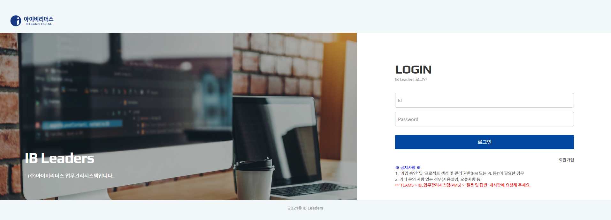

>### 회원가입

>> 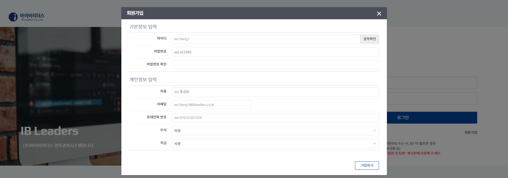

> 사용자 유형별 화면

> ### 1.일반사용자
>> ### 작업(Job) 조회
>>> 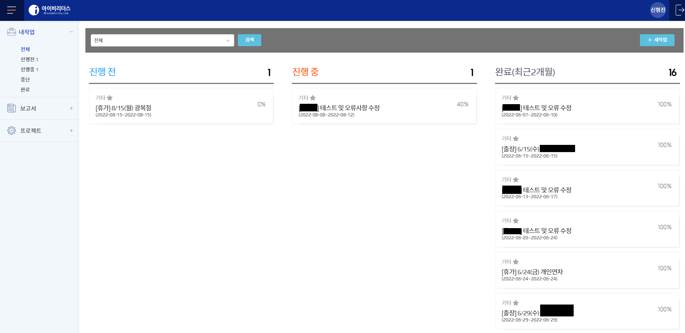

>> ### 완료 작업 조회
>>> 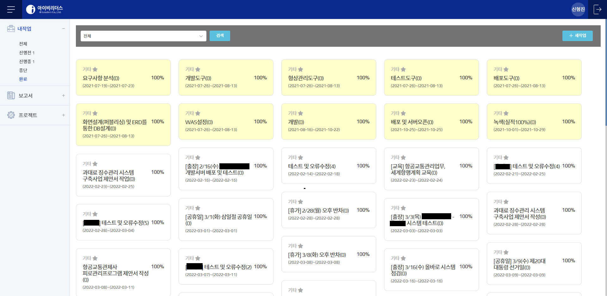

>> ### 작업 상세조회
>>> 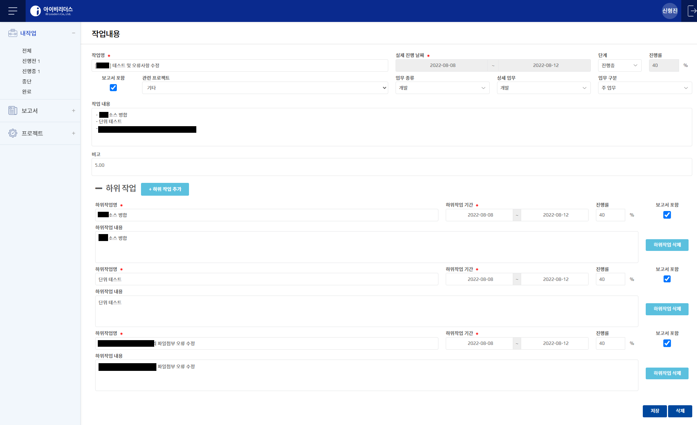

>> ### 주간보고서(부서별) 조회
>>> .png)

>> ### 주간보고서(프로젝트별) 조회
>>> .png)

>> ### 주간보고서 상세 조회
>>> 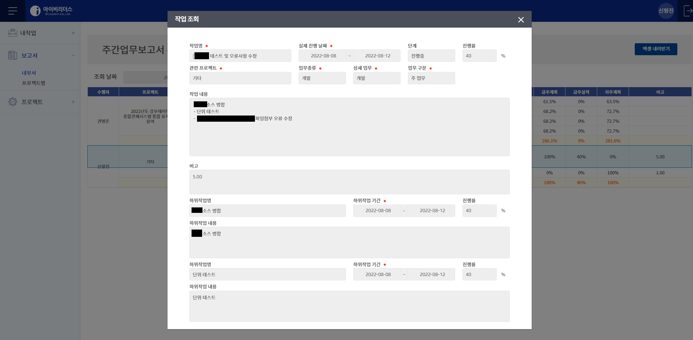

>> ### 프로젝트 조회
>>> 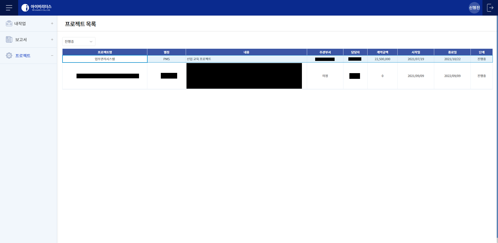

>> ### 프로젝트 WBS 조회(중간관리자에게 CRUD 권한을 받은 일반사용자 화면)
>>> 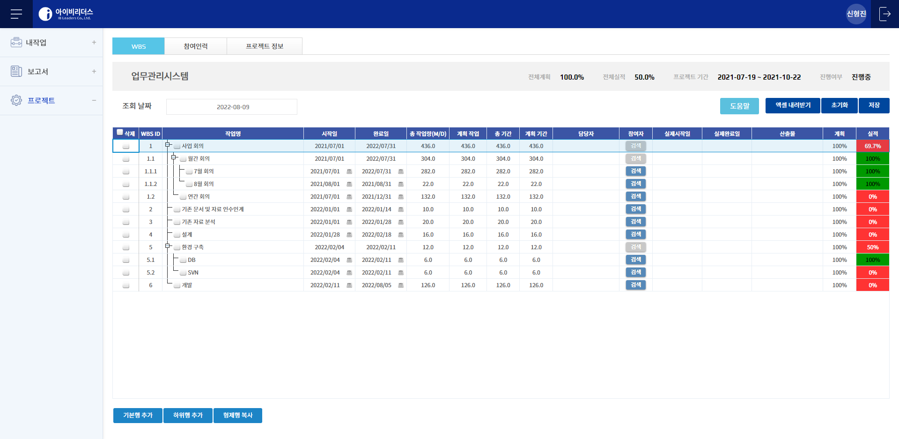

>> ### 프로젝트 상세 조회(중간관리자에게 CRUD 권한을 받은 일반사용자 화면)
>>> 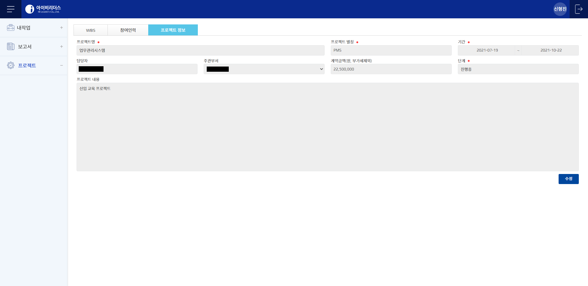

> ### 2.관리자
>> ### 회원관리 - 회원 목록 조회
>>> 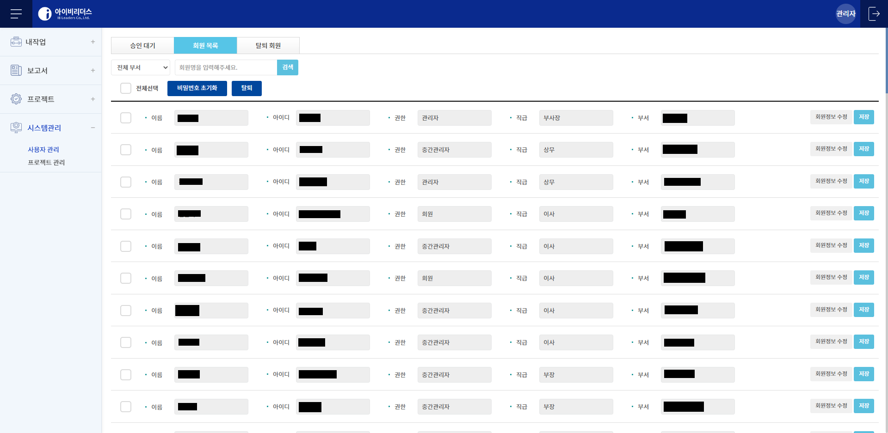

>> ### 회원관리 - 탈퇴 회원 목록 조회
>>> 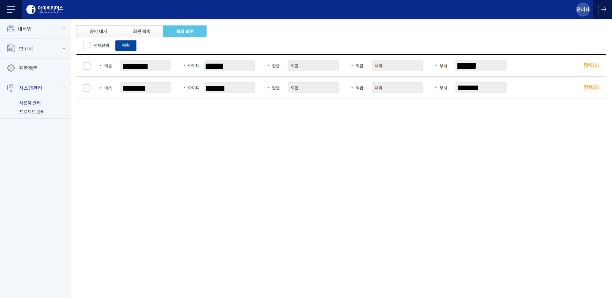

>> ### 프로젝트 관리 - 프로젝트 목록 조회
>>> 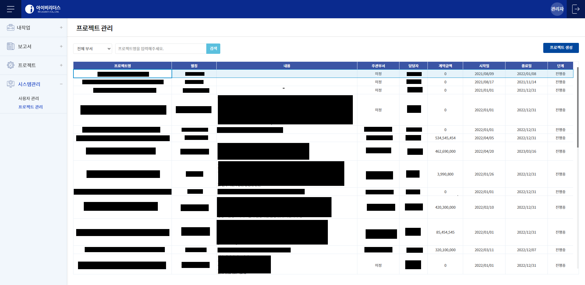

>> ### 프로젝트 관리 - 프로젝트 권한 관리
>>> 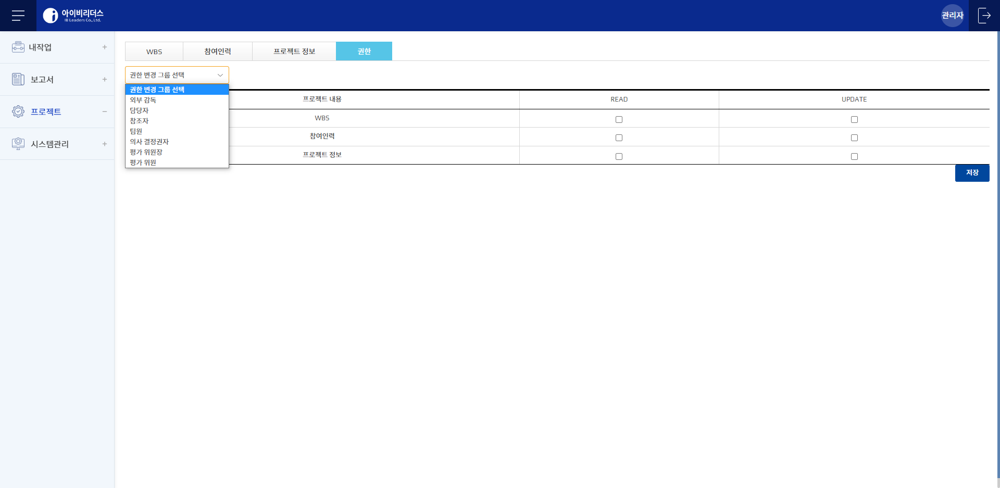

>> ### 프로젝트 WBS 관리 - PM의 Job 할당(중간관리자 이상급은 PM 또는 PL)
>>> 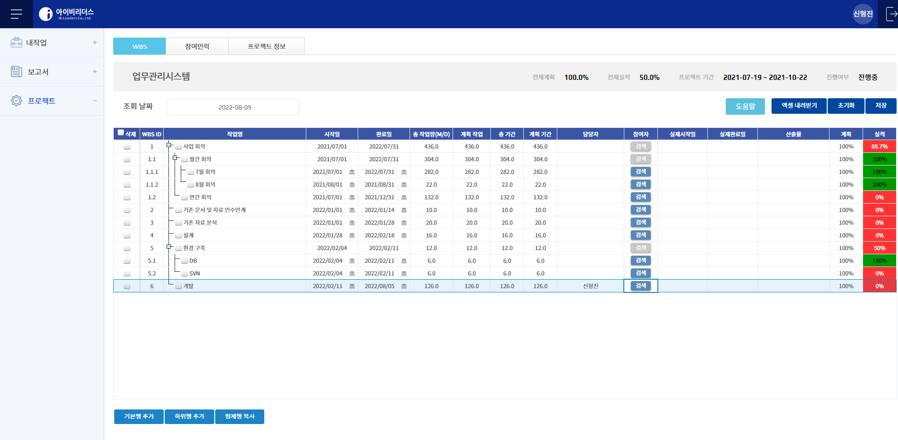

> ### 일반사용자 할당받은 Job 화면
>> 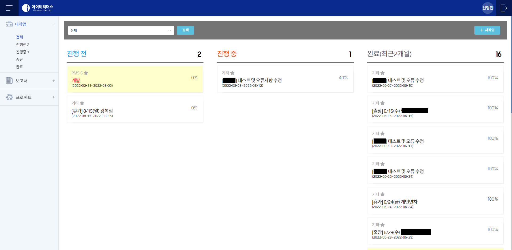

